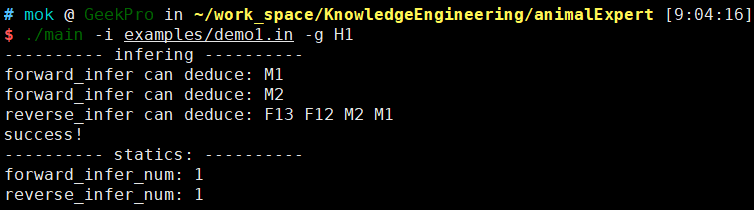

# 实验报告一

# 动物识别专家系统 ANIMAL

## 一、实验目标

1. 设计基于规则的正向推理与逆向推理混合的算法
2. 示例演示

## 二、推理算法描述

### 1、正向推理

**算法描述**：

> 在产生式系统运行过程中，要不断地用 GDB 中的数据和产生式进行匹配，使数据和产生式的左部匹配，对匹配成功的产生式执行右部。

**伪代码描述**：

```c++
Procedure Achieve(G)
扫描知识库，寻找能导出 G 的规则集 S；
IF S 为空 THEN 
	询问用户关于 G 的信息；
ELSE 
WHILE G 未知 AND S 非空 DO
 	BEGIN
	调用过程 Choose_Rule(S)，从S中选出规则R；
	G1 ← R 的“前提部分”；
	IF G1 未知 THEN
		调用过程 Achieve(G1)；
	IF G1 为真 THEN 
		执行R的“结论部分”，并从S中去掉规则R
END
```

### 2、反向推理

**算法描述**：

> 反向推理时，要把子目标和 GDB 中的数据或产生式右部匹配。与数据匹配成功者生成叶节点；与产生式右部匹配成功者，则使该产生式左部成为新的子目标。

伪代码描述：

```c++
Procedure Achieve(G)
扫描知识库，寻找能导出 G 的规则集 S；
IF S 为空 THEN 
	询问用户关于 G 的信息；
ELSE 
WHILE G 未知 AND S 非空 DO
 	BEGIN
	调用过程 Choose_Rule(S)，从S中选出规则R；
	G1 ← R 的“前提部分”；
	IF G1 未知 THEN
		调用过程 Achieve(G1)；
	IF G1 为真 THEN 
		执行R的“结论部分”，并从S中去掉规则R
END
```

## 三、实验内容

### 1、**算法思路**：

交错使用正向推理和反向推理。

具体来说，首先进行一轮正向推理，结束后更新数据基 `DB`​。这里正向推理一轮是指从 `KB`​ 中选取的规则集 `RS`​ 中的规则全部应用完毕，即使问题 `Q`​ 仍未被解决。

然后开始执行一轮反向推理，与原始算法不同的是此处不再递归反向推理子目标 `G1`​，而是用所得新的子目标 `G1`​ 更新问题 `Q`​。

上述过程，正向推理和反向推理交错迭代，若推理成功，会产生两种情况：

1. 正向推理中，成功推导出多轮更新后的问题 `Q`​
2. 反向推理中，推导得到的子目标出现在数据基 `DB`​ 中

### 2、**算法实现**：

**AnimalExpert.h**

```c++
#ifndef ANIMALEXPERT_H
#define ANIMALEXPERT_H

#include <cassert>
#include <iostream>
#include <random>
#include <string>
#include <unordered_map>
#include <unordered_set>

using std::pair;
using std::string;
using std::unordered_map;
using std::unordered_set;

// 定义 unordered_set 的哈希函数
struct hash_unordered_set {
    size_t operator()(const unordered_set<string>& s) const {
        size_t hash_value = 0;
        for (const auto& element : s) {
            hash_value ^= std::hash<string>()(element) + 0x9e3779b9 + (hash_value << 6) + (hash_value >> 2);
        }
        return hash_value;
    }
};

// 定义 unordered_set 的比较函数
struct equal_unordered_set {
    bool operator()(const unordered_set<string>& a, const unordered_set<string>& b) const {
        return a == b;
    }
};

using myset = unordered_set<string>;
using mymap = unordered_map<unordered_set<string>, string, hash_unordered_set, equal_unordered_set>;

class AnimalExpert {
   private:
    myset m_db;                    // 数据基
    mymap m_kb;                    // 知识库
    size_t forward_infer_num = 0;  // 统计正向推理次数
    size_t reverse_infer_num = 0;  // 统计逆向推理次数
    bool succ = false;

   public:
    AnimalExpert(mymap kb) : m_kb(kb) {}

    /* 可以采取一些启发式的方法进行规则选择，此处随机选择一条规则 */
    pair<myset, string> select_rule(mymap rs) {
        std::random_device rd;
        std::mt19937 gen(rd());
        std::uniform_int_distribution<> dis(0, rs.size() - 1);

        auto it = std::next(rs.begin(), dis(gen));
        return *it;
    }

    /* 正向推理 */
    void forward_infer(string goal) {
        forward_infer_num++;
        mymap rs;
        assert(!m_kb.empty());
        /* 扫描 DB 和 KB 选取可用规则集 RS*/
        for (auto k : m_kb) {
            auto lhs = k.first;
            bool is_match = true;
            /* 判断当前规则左部的变量是否都出现在数据基中 */
            for (auto d : lhs) {
                if (m_db.find(d) == m_db.end()) {
                    is_match = false;
                    break;
                }
            }
            if (is_match) {
                rs[lhs] = k.second;
            }
        }
        assert(!rs.empty());
        if (rs.empty()) {
            std::cout << "forward_infer: Sorry. I can't come to that conclusion !" << std::endl;
            exit(0);
        }

        while (!rs.empty()) {
            auto r = select_rule(rs);

            string rhs = r.second;
            std::cout << "forward_infer can deduce: " + rhs << std::endl;
            m_db.insert(rhs);
            if (rhs == goal) {
                std::cout << "success!" << std::endl;
                succ = true;
                return;
            }
            rs.erase(r.first);
        }
    }

    myset reverse_infer(string goal) {
        reverse_infer_num++;
        myset new_goals;
        mymap rs;
        for (auto k : m_kb) {
            string rhs = k.second;
            if (rhs == goal)
                rs[k.first] = rhs;
        }

        if (rs.empty()) {
            std::cout << "reverse_infer: Sorry. I can't come to that conclusion !" << std::endl;
            exit(0);
        }

        while (!rs.empty()) {
            auto r = select_rule(rs);
            auto lhs = r.first;
            std::cout << "reverse_infer can deduce: ";
            for (auto l : lhs) {
                std::cout << l << " ";
            }
            std::cout << std::endl;

            bool is_succ = true;
            for (auto l : lhs) {
                new_goals.insert(l);
                if (m_db.find(l) == m_db.end()) {
                    is_succ = false;
                    break;
                }
            }
            if (is_succ) {
                std::cout << "success!" << std::endl;
                succ = true;
                return new_goals;
            }
            rs.erase(r.first);
        }
        return new_goals;
    }

    void infer(myset facts, string goal) {
        std::cout << "----------" << " infering " << "----------" << std::endl;
        m_db.insert(facts.begin(), facts.end());
        // map<string, string> used_rs;
        myset goals;
        myset new_goals;
        goals.insert(goal);

        while (true) {
            if (succ)
                break;
            for (auto g : goals) {
                forward_infer(g);
            }
            for (auto g : goals) {
                new_goals = reverse_infer(g);
            }
            goals.insert(new_goals.begin(), new_goals.end());
        }
    }

    void display_static() {
        std::cout << "----------" << " statics: " << "----------" << std::endl;
        std::cout << "forward_infer_num: " << forward_infer_num << std::endl;
        std::cout << "reverse_infer_num: " << reverse_infer_num << std::endl;
        // std::cout << "KB:" << std::endl;
        // for (auto k : m_kb) {
        //     for (auto l : k.first) {
        //         std::cout << l << " ";
        //     }
        //     std::cout << "-> " << k.second << std::endl;
        // }
        // std::cout << "DB:" << std::endl;
        // for (auto d : m_db) {
        //     std::cout << d << " ";
        // }
    }
};

#endif
```

**main.cpp**

```c++
#include <fstream>
#include <iostream>
#include <sstream>

#include "AnimalExpert.h"

void parse_input(string input_file, mymap& kb, myset& db) {
    std::ifstream file(input_file);

    if (!file.is_open()) {
        std::cerr << "Unable to open file" << std::endl;
        exit(0);
    }

    std::string line;
    bool is_db = true;
    while (std::getline(file, line)) {
        if (line.find("DB") == 0)
            continue;
        if (line.find("KB") == 0) {
            is_db = false;
            continue;
        }
        std::string w;
        std::istringstream iss(line);
        if (is_db) {
            while (iss >> w) {
                db.insert(w);
            }
        } else {
            myset lhs;
            std::string rhs;
            bool is_lhs = true;
            while (iss >> w) {
                if (w == "->") {
                    is_lhs = false;
                    continue;
                }
                if (is_lhs)
                    lhs.insert(w);
                else
                    rhs = w;
            }
            kb[lhs] = rhs;
            lhs.clear();
        }
    }
}

void print_usage(string program) {
    std::cout << "Usage: " << program << " [options]\n"
              << "Options:\n"
              << "  --help, -h       Display this help message\n"
              << "  --version, -v    Display the program version\n"
              << "  --input, -i      Input file path\n"
              << "  --goal, -g       Objectives of the derivation"
              << std::endl;
    exit(0);
}

void parseCmdLineArg(int argc, char* argv[], string& inputFile, string& goal) {
    if (argc == 1) {
        print_usage(argv[0]);
        exit(0);
    }
    for (int i = 1; i < argc; ++i) {
        std::string arg = argv[i];

        if (arg == "--help" || arg == "-h") {
            print_usage(argv[0]);
            exit(0);
        } else if (arg == "--version" || arg == "-v") {
            std::cout << "Program version: 1.0" << std::endl;
            exit(0);
        } else if (arg == "--input" || arg == "-i") {
            inputFile = argv[++i];
        } else if (arg == "--goal" || arg == "-g") {
            goal = argv[++i];
        } else {
            std::cerr << "Unknown argument: " << arg << std::endl;
            exit(1);
        }
    }
}

int main(int argc, char* argv[]) {
    string inputFile, goal;
    parseCmdLineArg(argc, argv, inputFile, goal);

    myset db;
    mymap kb;
    parse_input(inputFile, kb, db);
    assert(!kb.empty());
    AnimalExpert expert = AnimalExpert(kb);
    expert.infer(db, goal);
    expert.display_static();

    return 0;
}
```

## 四、实验结果

对提供的两个测试文件：demo1.in 和 demo2.in 的测试如下：

### 1、demo1.in

**测试文件内容**：

```c++
DB:
F12 F13 F6 F1
KB:
F1 -> M1
F2 -> M1
F3 -> M4
F4 F5 -> M4
F6 -> M2
F7 F8 F9 -> M2
M1 F10 -> M3
M1 F11 -> M3
M1 M2 F12 F13 -> H1
M1 M2 F12 F14 -> H2
M3 F15 F16 F13 -> H3
M3 F14 -> H4
M4 F17 F15 F16 F18 -> H5
M4 F17 F19 F18 -> H6
M4 F20 -> H7
```

**程序运行结果**：



**实验分析**：

可以看到，第一轮正向推理推导出 `M1`​ 和 `M2`​ 并将其放入数据基；随后的逆向推理得到 `F13`​、`F12`​、`M2`​、`M1`​，检查数据基发现，四个条件都已经存储于数据基，故推理成功。

### 2、demo2.in

**测试文件内容**：

```c++
DB:
F2 F7 F8 F9 F12 F14
KB:
F1 -> M1
F2 -> M1
F3 -> M4
F4 F5 -> M4
F6 -> M2
F7 F8 F9 -> M2
M1 F10 -> M3
M1 F11 -> M3
M1 M2 F12 F13 -> H1
M1 M2 F12 F14 -> H2
M3 F15 F16 F13 -> H3
M3 F14 -> H4
M4 F17 F15 F16 F18 -> H5
M4 F17 F19 F18 -> H6
M4 F20 -> H7
```

**程序运行结果**：


**实验分析**：

第一轮正向推理得出 `M2`​ 和 `M1`​，并将其加入数据基；随后的逆向推理得到 `F14`​、`F12`​、`M2`​、`M1`​，四个条件都处于数据基中，故推理成功。

‍
