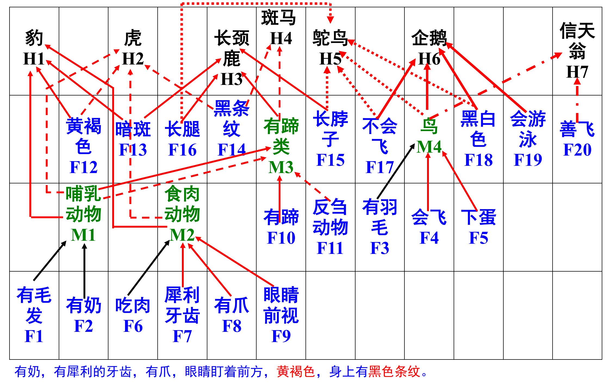

# 简单的专家系统示例——动物识别专家系统 ANIMAL
⑴ 知识库 ANIMAL 的知识库非常小，仅仅包含 15 条规则（一般说来，一个专家系统的知识库应包含≥几百条规则）；

⑵ 解空间很小，仅仅包含 7 个解，或 7 个最高假设（在一个特定的动物园里，共有虎、豹、长颈鹿、斑马、鸵鸟、企鹅和信天翁等 7 种动物）；

⑶ 初始事实集合很小，仅仅包含 20 个事实，如图中的 F1 至 F20；

⑷ 数据（即事实、证据、断言），知识（即浅层知识，规则）和推理都是精确的，即确定性的；

⑸ 知识库
R1： 如果 某动物有毛发（F1）
 则 该动物是哺乳动物（M1）

R2： 如果 某动物有奶（F2）
 则 该动物是哺乳动物（M1）

R3： 如果 某动物有羽毛（F3）
 则 该动物是鸟（M4）

R4： 如果 某动物会飞（F4），且下蛋（F5）
 则 该动物是鸟（M4）

R5： 如果 某动物吃肉（F6）
 则 该动物是食肉动物（M2）

R6： 如果 某动物有锋利的牙齿（F7），且有爪（F8），且眼睛盯着前方（F9）
 则 该动物是食肉动物（M2）

R7： 如果 某动物是哺乳动物（M1），且有蹄（F10）
 则 该动物是有蹄类哺乳动物（M3）

R8： 如果 某动物是哺乳动物（M1），且反刍（F11）
 则 该动物是有蹄类哺乳动物（M3），且偶蹄类

R9： 如果 某动物是哺乳动物（M1），且是食肉动物（M2）, 且黄褐色（F12），且有暗班（F13）
 则 该动物是豹（H1）

R10：如果 某动物是哺乳动物（M1），且是食肉动物（M2），且黄褐色（F12），且有黑色条纹（F14）
 则 该动物是虎（H2）

R11：如果 某动物是有蹄类哺乳动物（M3），且有长脖子（F15），且有长腿（F16），且有暗斑（F13）
 则 该动物是长颈鹿（H3）

R12：如果 某动物是有蹄类哺乳动物（M3），且有黑条纹（F14）
 则 该动物是斑马（H4）

R13：如果 某动物是鸟（M4），且不会飞（F17），且有长脖子（F15），且有长腿（F16），且是黑白色（F18）
 则 该动物是鸵鸟（H5）

R14：如果 某动物是鸟（M4），且不会飞（F17），且会游泳（F19）， 且是黑白色（F18）
 则 该动物是企鹅（H6）

R15：如果 某动物是鸟（M4），且善飞（F20）
 则 该动物是信天翁（H7）

⑹ ANIMAL 的正向推理网络


⑺ 正向推理网络中的节点

初始事实节点———蓝色

中间结论节点———绿色

最高假设节点———黑色

中间结论节点和最高假设节点又被分为“与节点”、“或节点”、“与或节点”

⑻ ANIMAL 的数据基 GDB（一个单调增加的数据基！！！）

启动之初，数据基为空，用户回答和输入的事实，ANIMAL 运行推导出来的中间结论和最高假设都实时地插入数据基，因此在推理结束之前，ANIMAL 的数据基中存储的事实不断增加。
当数据基中的事实不能再增加时，ANIMAL 运行结束。

⑼ 正向推理的例子

初始 GDB = {黄褐色（F12），暗班（F13），吃肉（F6），有毛发（F1）}

由 R1 推出 M1（哺乳动物）；

由 R5 推出 M2（食肉动物）；

由 R9 推出 H1（豹），此时 GDB = ｛F1, F6, F12, F13, M1, M2, H1｝。

⑽ 逆向推理的例子

验证所看到的动物是不是老虎？

已经观察到如下事实：

被观察动物：有奶，有犀利的牙齿，有爪，眼睛盯着前方，黄褐色，

身上有黑色条纹。

在图上验证。


# 程序编译及运行说明
## 编译
```shell
$ cd animalExpert/
$ make
```
## 运行
程序可用选项：
```shell
Options:
    --help, -h       Display this help message
    --version, -v    Display the program version
    --input, -i      Input file path
    --goal, -g       Objectives of the derivation
```
示例：
```shell 
$ ./animalExpert -i examples/demo1.in -g H1
```
输出：
```shell
---------- infering ----------
forward_infer can deduce: M2
forward_infer can deduce: M1
reverse_infer can deduce: F13 F12 M2 M1 
success!
---------- statics: ----------
forward_infer_num: 1
reverse_infer_num: 1
```